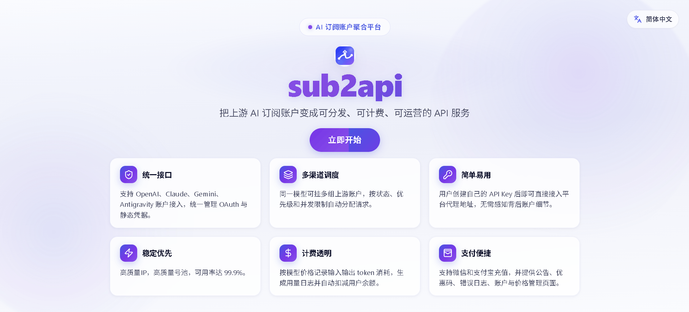
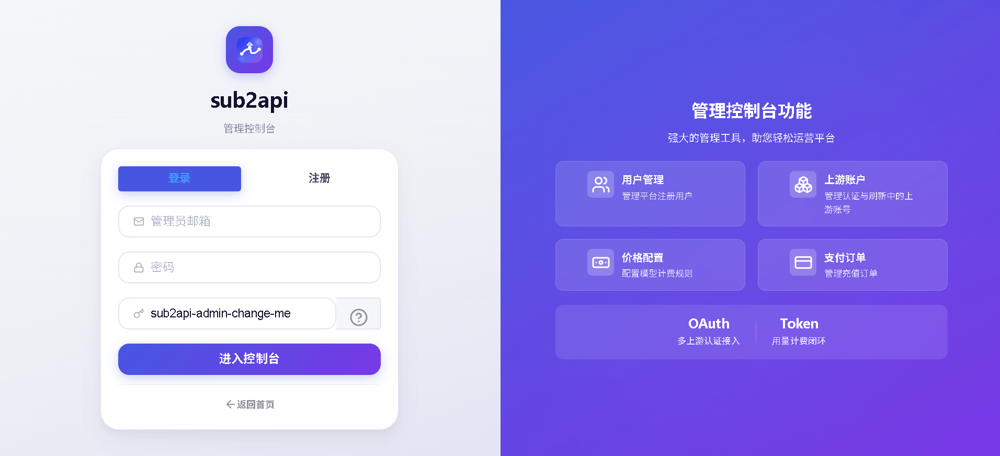
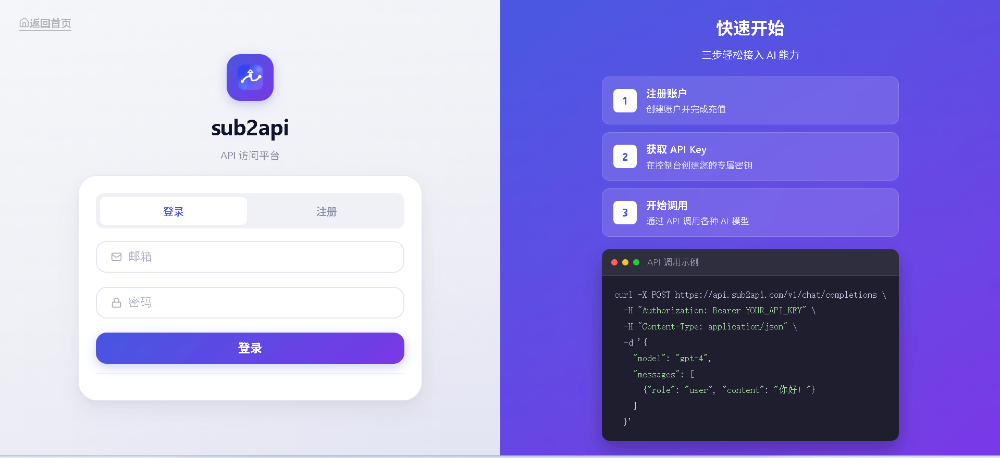
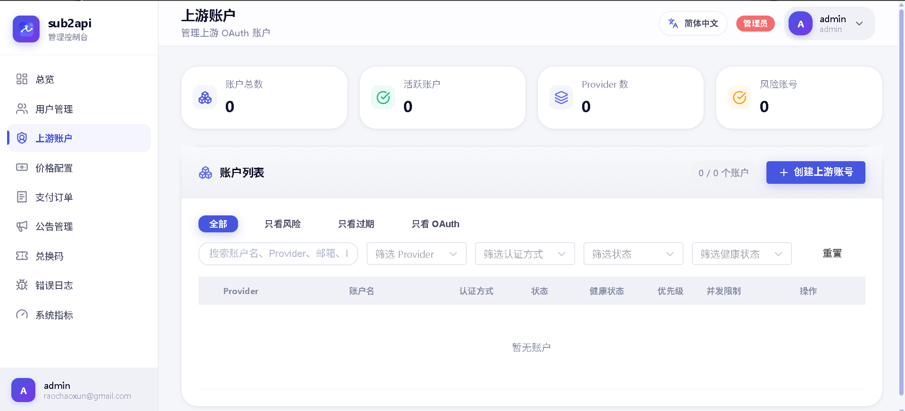
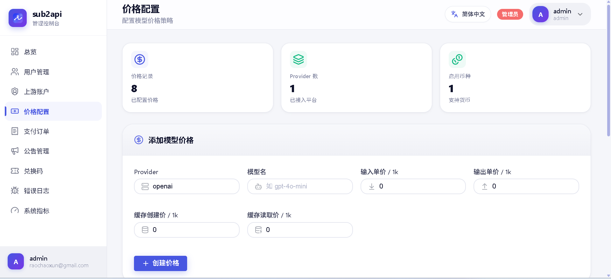
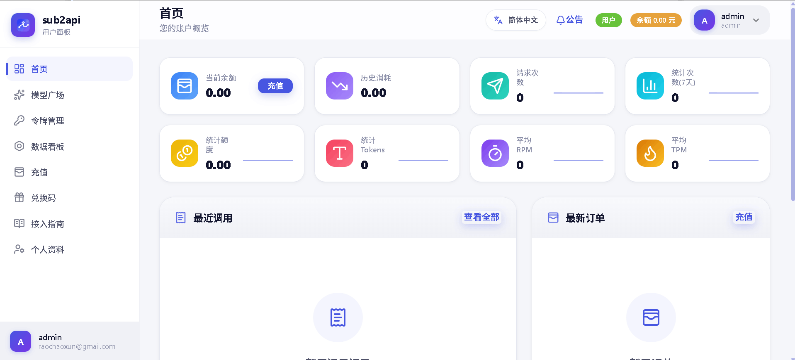
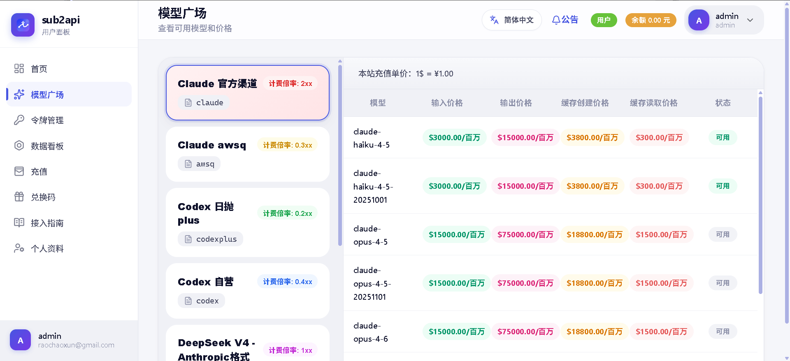
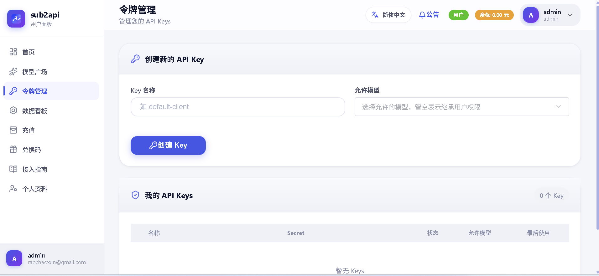

# sub2api lite

[English](./README_EN.md)

声明 ：本项目不是https://github.com/Wei-Shaw/sub2api 的 二次开发版本，只是借用 sub2api 这个名字；其他毫无关系； Wei-Shaw/sub2api 有 60w+行代码，70+个数据库表； 我这个 只有2W行代码 16个表； 做过开发都知道无论如何裁剪也是无法做到。代码是完全重新开发； 借鉴了 Wei-Shaw/sub2api 和 one api的一些思路

当前目标不是复制其他项目的全部能力，而是优先保住最核心闭环，一个最精简的个人版单机版/或几十人小团队，目标不是大型几百人使用的中转站。主要因为存储使用的是无依赖的sqlite。但是麻雀虽小，五脏俱全，核心功能， 中转，支付，统计 都有
- 多用户 + API Key
- 账号池 + Provider 插件化
- OpenAI 兼容协议转发
- 模型价格与余额扣费
- SQLite + GORM 单机部署
- `gopay` 充值支付接入

## 产品截图

<table>
  <tr>
    <td></td>
    <td></td>
    <td></td>
  </tr>
  <tr>
    <td></td>
    <td></td>
    <td></td>
  </tr>
  <tr>
    <td></td>
    <td></td>
    <td></td>
  </tr>
</table>

## 管理员账号说明

- 系统**没有内置默认管理员账号和默认密码**
- 首个管理员账号需要在首次部署后通过 `POST /api/admin/bootstrap` 或前端"初始化首个管理员"页面创建
- **管理员密码就是你初始化时自己提交的密码**
- 管理接口额外需要请求头 `X-Admin-Token`

如果你没有显式传入 `-admin-token` 或 `SUB2API_ADMIN_TOKEN`，默认值是：

```text
sub2api-admin-change-me
```

注意：

- `X-Admin-Token` 不是管理员登录密码
- 它只用于放行管理接口
- 管理员是否能进入后台，还要同时满足邮箱和密码登录成功

## 启动

本项目**不是只有命令行接口**，它自带 Vue3 前端界面，包含：

- 首页
- 管理员登录页与管理后台
- 普通用户登录页与用户控制台
- 账户、价格、API Key、用量、充值、公告、优惠码、错误日志等页面

有两种使用方式：

### 方式一：前后端一体运行

前端构建产物会嵌入 Go 二进制。启动后端后，直接打开：

- `http://127.0.0.1:8080/` 首页
- `http://127.0.0.1:8080/login/user` 用户登录
- `http://127.0.0.1:8080/login/admin` 管理员登录

### 方式二：前后端分开调试

后端监听 `8080`，前端开发服务器监听 `5173`。

1. 启动后端
2. 进入 `web` 目录执行 `npm run dev`
3. 打开：
   - `http://127.0.0.1:5173/` 首页
   - `http://127.0.0.1:5173/login/user` 用户登录
   - `http://127.0.0.1:5173/login/admin` 管理员登录

前端开发态已配置代理，默认会把 `/api`、`/v1`、`/v1beta`、`/v1internal:` 请求转发到 `http://127.0.0.1:8080`。

## 后端启动

```bash
cd server
go run ./cmd/sub2api \
  -admin-token your-admin-token \
  -public-base-url http://127.0.0.1:8080 \
  -gopay-url http://127.0.0.1:8081 \
  -gopay-pid 10000 \
  -gopay-key your-gopay-key
```

也可以用环境变量：

```bash
export SUB2API_ADMIN_TOKEN=your-admin-token
export SUB2API_PUBLIC_BASE_URL=http://127.0.0.1:8080
export SUB2API_GOPAY_URL=http://127.0.0.1:8081
export SUB2API_GOPAY_PID=10000
export SUB2API_GOPAY_KEY=your-gopay-key
cd server && go run ./cmd/sub2api
```

## 前端调试

```bash
cd web
npm run dev
```

如果后端不是 `127.0.0.1:8080`，可以这样覆盖代理目标：

```bash
cd web
VITE_PROXY_TARGET=http://127.0.0.1:18080 npm run dev
```

## 首次初始化

1. 启动后端服务
2. 打开 `http://127.0.0.1:8080/`，或前端开发态 `http://127.0.0.1:5173/`
3. 进入"管理员登录"页，点击"初始化首个管理员"
4. 填写管理员邮箱、密码，以及 `X-Admin-Token` 对应的管理令牌
5. 初始化成功后进入管理后台
6. 在管理后台创建上游账户、模型价格、普通用户和 API Key
7. 用户登录后即可在用户界面完成 Key 管理、查看用量、发起充值
8. 用用户 API Key 调 `/v1/chat/completions` 等代理接口

如果你不想走界面，也可以直接调用 bootstrap 接口：

示例：

```bash
curl -X POST http://127.0.0.1:8080/api/admin/bootstrap \
  -H 'Content-Type: application/json' \
  -H 'X-Admin-Token: your-admin-token' \
  -d '{
    "name": "admin",
    "email": "admin@example.com",
    "password": "your-admin-password"
  }'
```

说明：

- 这里的 `password` 就是管理员登录密码
- bootstrap 成功后会直接返回该管理员的 `access_token` 和 `refresh_token`
- 之后可用该邮箱和密码从前端登录页进入系统
