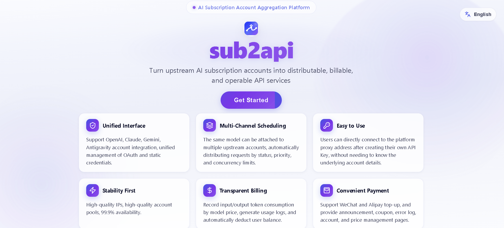
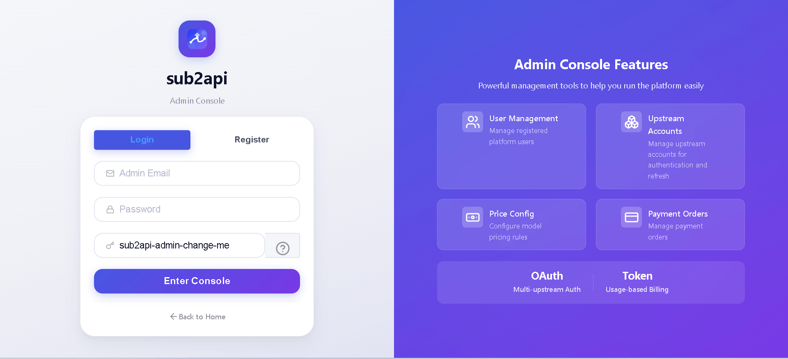
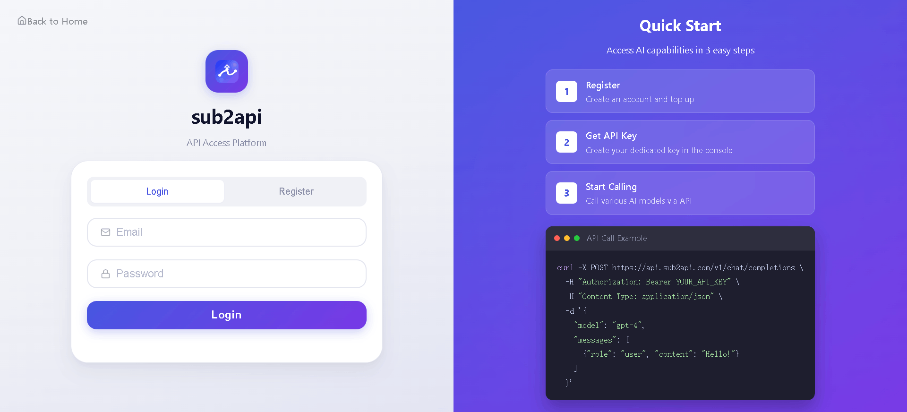
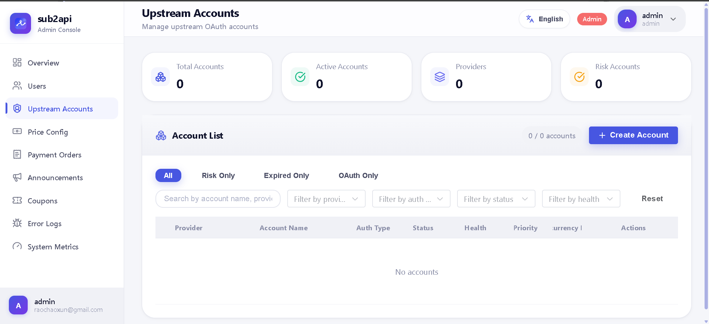
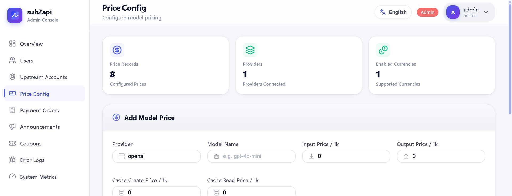
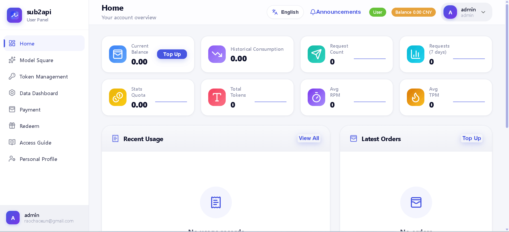
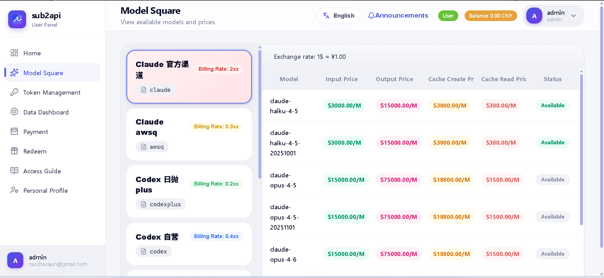
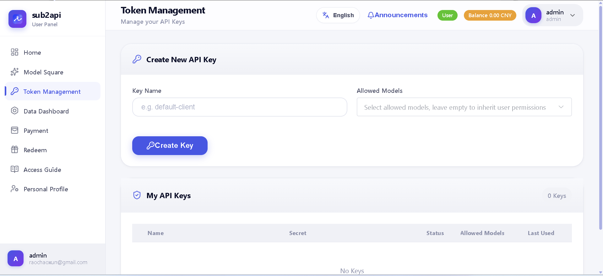

# sub2api lite

[中文版](./README.md)

**Disclaimer**: This project is not a derivative work of https://github.com/Wei-Shaw/sub2api. It only borrows the name "sub2api"; there is no other relationship. Wei-Shaw/sub2api has over 600k lines of code and 70+ database tables, while this one has only about 20k lines of code and 16 tables. Anyone with development experience knows that no amount of trimming could produce this. The code has been completely rewritten from scratch, taking some ideas from Wei-Shaw/sub2api and one-api.

The current goal is not to replicate all the capabilities of other projects, but to prioritize securing the core closed loop — a minimal personal standalone edition, or for small teams of a few dozen people; it is not intended as a large-scale relay station for hundreds of users. This is mainly because the storage uses dependency-free SQLite. However, as the saying goes, "small as a sparrow, it has all five vital organs" — the core features such as proxy/relay, payment, and statistics are all there.
- Multi-user + API Key
- Account pool + Provider plugin system
- OpenAI-compatible protocol forwarding
- Model pricing and balance deduction
- SQLite + GORM single-machine deployment
- `gopay` top-up payment integration

## Screenshots

<table>
  <tr>
    <td></td>
    <td></td>
    <td></td>
  </tr>
  <tr>
    <td></td>
    <td></td>
    <td></td>
  </tr>
  <tr>
    <td></td>
    <td></td>
    <td></td>
  </tr>
</table>

## Administrator Account Notes

- The system **does not have a built-in default admin account or default password**.
- The first admin account must be created after the initial deployment via `POST /api/auth/register-admin` or directly from the front-end admin login page in register mode.
- **The admin password is the one you submit during registration**.
- Admin APIs use the normal authenticated session; a logged-in user with role `admin` can access the admin console.

## Startup

This project is **not CLI-only** – it comes with a Vue3 front-end interface, including:

- Home page
- Admin login page and admin dashboard
- Regular user login page and user console
- Pages for account, pricing, API Key, usage, top-up, announcements, promo codes, error logs, etc.

There are two ways to use it:

### Option 1: Integrated front-end and back-end

The front-end build output is embedded into the Go binary. After starting the backend, simply open:

- `http://127.0.0.1:8080/` – Home page
- `http://127.0.0.1:8080/login/user` – User login
- `http://127.0.0.1:8080/login/admin` – Admin login

### Option 2: Separate front-end and back-end for development

The backend listens on `8080`, the front-end dev server listens on `5173`.

1. Start the backend
2. Go into the `web` directory and run `npm run dev`
3. Open:
   - `http://127.0.0.1:5173/` – Home page
   - `http://127.0.0.1:5173/login/user` – User login
   - `http://127.0.0.1:5173/login/admin` – Admin login

The front-end dev setup is configured with a proxy that forwards requests to `/api`, `/v1`, and `/v1beta` to `http://127.0.0.1:8080` by default.

## Backend Startup

```bash
cd server
go run ./cmd/sub2api \
  -public-base-url http://127.0.0.1:8080 \
  -gopay-url http://127.0.0.1:8081 \
  -gopay-pid 10000 \
  -gopay-key your-gopay-key
```

You can also use environment variables:

```bash
export SUB2API_PUBLIC_BASE_URL=http://127.0.0.1:8080
export SUB2API_GOPAY_URL=http://127.0.0.1:8081
export SUB2API_GOPAY_PID=10000
export SUB2API_GOPAY_KEY=your-gopay-key
cd server && go run ./cmd/sub2api
```

## Front-end Development

```bash
cd web
npm run dev
```

If the backend is not at `127.0.0.1:8080`, you can override the proxy target like this:

```bash
cd web
VITE_PROXY_TARGET=http://127.0.0.1:18080 npm run dev
```

## First-Time Initialization

1. Start the backend service
2. Open `http://127.0.0.1:8080/`, or the front-end dev version `http://127.0.0.1:5173/`
3. Go to the "Admin Login" page and switch to register mode
4. Fill in the admin name, email, and password
5. After successful registration, enter the admin dashboard
6. In the admin dashboard, create upstream accounts, model prices, regular users, and API Keys
7. After users log in, they can manage API Keys, view usage, and initiate top-ups from the user interface
8. Use the user API Key to call proxy endpoints such as `/v1/chat/completions`

If you prefer to skip the UI, you can call the admin registration endpoint directly:

Example:

```bash
curl -X POST http://127.0.0.1:8080/api/auth/register-admin \
  -H 'Content-Type: application/json' \
  -d '{
    "name": "admin",
    "email": "admin@example.com",
    "password": "your-admin-password"
  }'
```

Explanation:

- The `password` field here is the admin login password.
- Upon successful registration, the response directly returns the admin's `access_token` and `refresh_token`.
- Afterwards, you can use that email and password to log in from the front-end login page.
